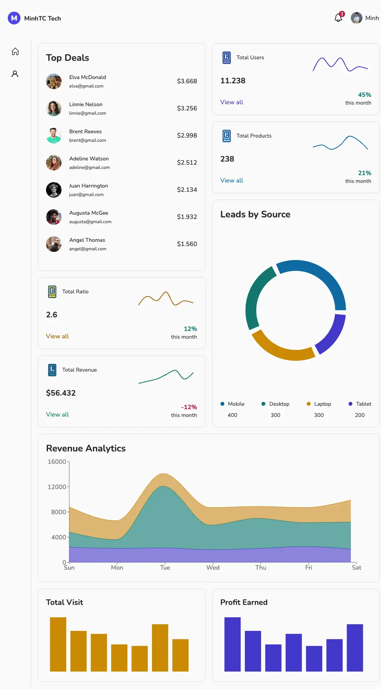

# Admin Dashboard - minhtc.tech



- This is a simple admin dashboard project built with React. It provides a user-friendly interface for managing and monitoring various aspects of an application or system.
- Live demo: https://main.d18q6xdhoyhswk.amplifyapp.com/
- Please give this source a star, thank you so much 🥰.

## Installation

1. Clone the repository.
2. Install the dependencies using npm:

   ```shell
   npm install
   ```

## Usage

To start the development server and run the admin dashboard locally, use the following command:

```shell
npm run dev
```

## Building for Production

To build the admin dashboard for production, use the following command:

```shell
npm run build
```

This will create a production-ready build in the `dist` directory.

## Linting

To lint the source code and ensure code quality, use the following command:

```shell
npm run lint
```

## Additional Scripts

- `npm run preview`: Build and serve the production build for local preview.
